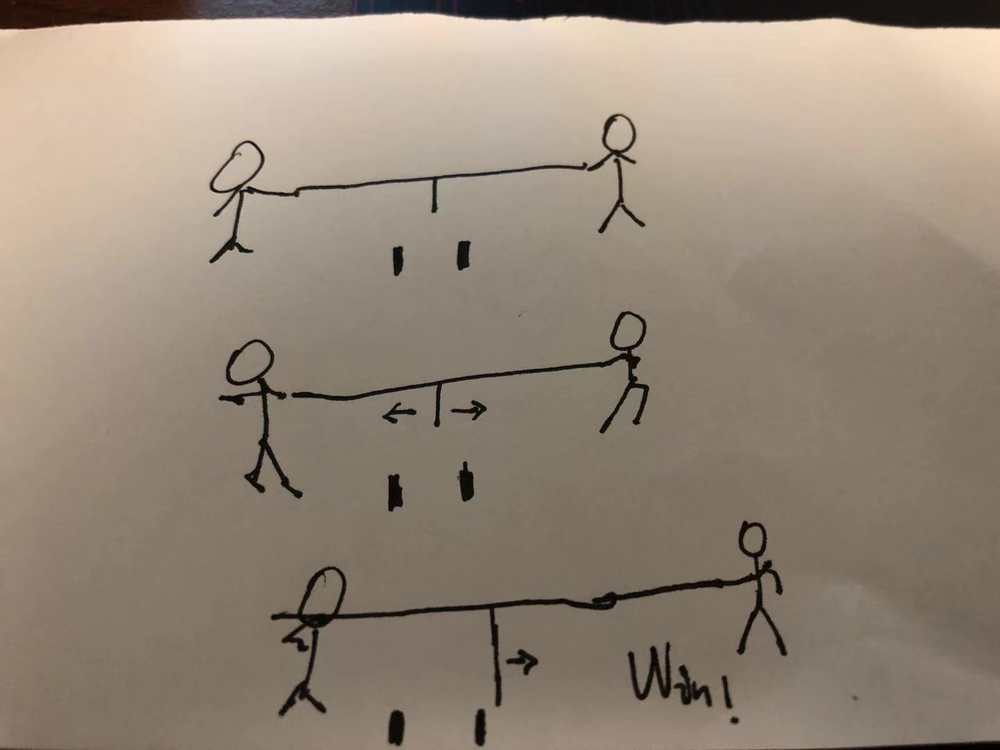
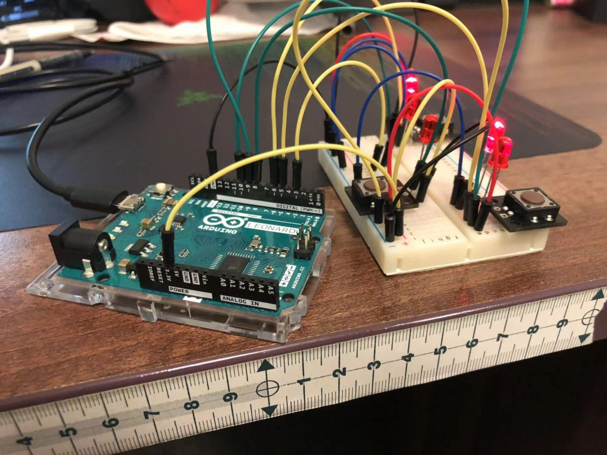
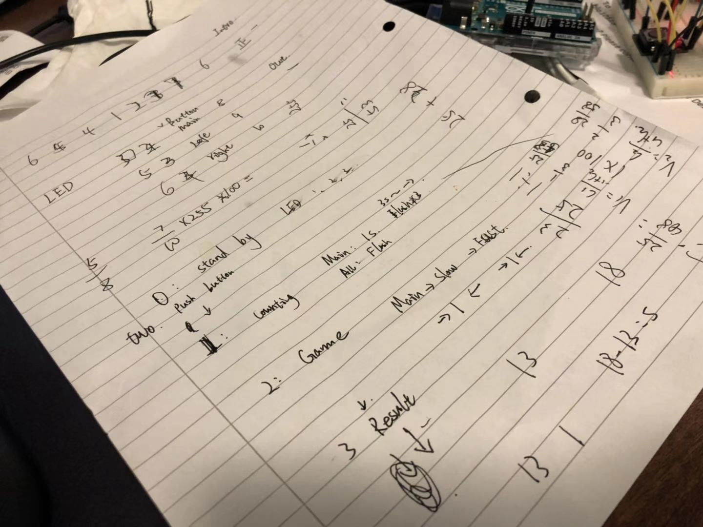

# Hi. This is the portfolio for Xiangsong Yang's Arduino work in CCI.

Xiangsong had finished a interactive game"OOPS" with Arduino Lenonardo, 3 button, 3 LEDS. 

By playing OOPS, gamers will be using button on the top "Main button" and side buttons "Competition button" .

When the game is on, it will run in Standby Mode, with three LEDS on in Counterclockwise.

By pressing the Main button, the game will begin and start to countdown with flash of green led.

Gmaers will smash the button as fast as they can to beat others and win the game.

When someone wins the game, the grenn LED will be on and show the winner.

If players wants to play again, pressing two competition buttons will start the game again.

Pressing Main button and Left button will get the game back to standby mode.

## Ideation

OOPS is a game that designed to have competitional and interactive gaming experience with peer. 

The main objective of this game is to compete the speed of smash buttons with another competitor. 

The condition of winning is to have obviously higher speed. 

The concept of the game

## The making process

The game is based on Arduino and progammed in Arduino IDE.

Xiangsong used breadboard and pin cables to make prototype and test.

Testing on arduino with extra LEDS for debugging.

The program simulation on paper.

